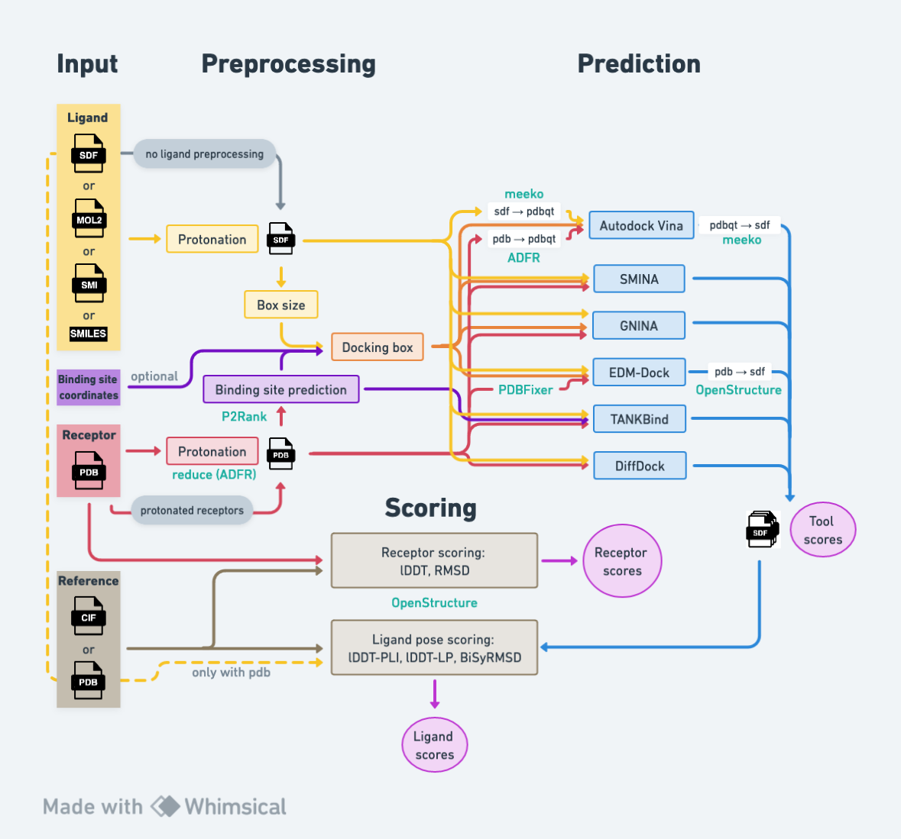

# PickyBinder

Welcome to PickyBinder, a workflow designed for benchmarking protein-ligand interaction prediction methods.

This repository contains the implementation of the PickyBinder workflow, which assesses various protein-ligand complex 
prediction tools, including **Autodock Vina, SMINA, GNINA, DiffDock, TANKBind, and EDM-Dock**. The evaluation includes 
reporting BiSyRMSD, lDDT-PLI, and lDDT-LP scores, calculated using OpenStructure, for each predicted ligand pose. 
For docking tools associated with the AutoDock family, the workflow conducts besides blind docking also ligand 
prediction either for all binding pockets identified by P2Rank or for a specific user-defined binding site.

[](workflow.png)

Ligand preparation starts from the SMILES string and includes standardization by neutralizing the charges, readjustment 
for pH 7 using protonation rules, and adding explicit hydrogen atoms. The 3D conformation is generated using the ETKDG 
method from RDKit and stored in SDF format. 
The receptor protein is hydrogenated using reduce (version 4.13) with the -FLIP option.

## General remark

PickyBinder is implemented as a Nextflow pipeline, offering flexibility and ease of use. Information about Nextflow 
can be found here https://www.nextflow.io/ and in the 
[Nextflow documentation](https://www.nextflow.io/docs/latest/index.html).   

The main workflow logic is defined in the **main.nf** file, while underlying processes 
are defined in the **modules** for each tool. Configuration for container usage (Singularity) and resource management 
for the executor (SLURM) is defined in the **nextflow.config** file. The locations of the required tools, Singularity 
images and default values are specified in the **params.config** file. 

Each workflow task has its dedicated working directory within 
the **work** folder, storing all output and log files. 
The designated output files are automatically copied to the **results'** folder. 
After a successful run, consider removing the work directory.  

During execution, the **trace_report.csv** tracks all completed tasks, including resource usage.
Upon successful completion, the **report.html** is generated, providing graphical information 
about each process.


# Table of contents

* [Dependencies](#Dependencies)
* [Input](#Input)
* [Running the workflow](#Running-the-workflow)
* [Outputs](#Outputs)
* [Failing tasks and problems](#Failing-tasks-and-problems)
* [Scoring only](#Scoring-only)
* [Citations](#Citations)


## Dependencies

Download the PickyBinder GitHub repository and unzip the **reduce_wwPDB_het_dict.txt.gz** file. 

Additionally, **tankbind_py38** Singularity image and **meeko conda** 
environment are needed to run the pipeline (see installation instructions below). 

### Nextflow

The workflow has been built using Nextflow version 23.04.2. 
Obtain Nextflow from https://www.nextflow.io/. 

### Protein-ligand prediction tools

The PickyBinder workflow has the capability to execute **Autodock Vina**, **SMINA**, **GNINA**, **DiffDock**, 
**TANKBind**, and **EDMDock**. 
The selection of which tools to incorporate into the workflow can be made when initiating the pipeline. 

For each protein-ligand prediction tool, ensure the required dependencies are installed. 
Refer to the documentation for each tool:

- **Autodock Vina**: Get the Autodock Vina v1.2.5 executable from https://github.com/ccsb-scripps/AutoDock-Vina/releases 
and create a Conda environment for the Python bindings as described in the Autodock Vina manual 
(https://autodock-vina.readthedocs.io/en/latest/installation.html). Either install **meeko** 0.4.0 into the same Conda environment, 
or make an own Conda environment for meeko (https://pypi.org/project/meeko/#2.-rdkit-molecule-from-docking-results).
- **SMINA**: Creat a Conda environment for SMINA v2020.12.10 (https://anaconda.org/conda-forge/smina).
- **GNINA**: Get the Singularity image for GNINA v1.0.3 (https://hub.docker.com/r/gnina/gnina/tags, tag: 1.0.3).
- **DiffDock**: Create a Conda environment according to the setup guide at https://github.com/gcorso/DiffDock (commit 2c7d438).
- **TANKBind**: Get Singularity image "tankbind_py38" (https://hub.docker.com/r/qizhipei/tankbind_py38, digest: 79a46540b547).
- **EDM-Dock**: Get EDM-Dock dependencies from https://github.com/MatthewMasters/EDM-Dock and follow the instructions. 
NOTE: If minimized poses should be scored, the pose needs to be saved to {key}_docked_min.pdb (adapt run_docking() 
function in EDM-Dock/scripts/dock.py).
Additionally, create a Conda environment for PDBFixer 1.9 (https://github.com/openmm/pdbfixer).

### Other tools
- **P2Rank**: Get P2Rank v2.4 executable from https://github.com/rdk/p2rank/releases .
- **OpenStructure**: Get Singularity image for OpenStructure 2.5.0 from 
https://git.scicore.unibas.ch/schwede/openstructure/container_registry/7
- **ADFRsuite**: Build Singularity image from the [ADFRsuite.def](environment_files/ADFRsuite.def) file in 
the environment_files directory.  

### Preparation of the params.config file

Copy **params.config.in** to **params.config** and adjust the following:
- Provide paths for **tool locations**, **conda containers**, and **singularity images**.
- P2Rank needs Java (8 to 18) to run. Eventually, provide a command to **load Java** (eg ```"ml load <Java version>"``` ) 
or leave it blank.
- The **cluster options** section gives the possibility to name the queues, partitions, and other desired SLURM options.
Memory and time are already defined. 

## Input

The following inputs are required to execute the workflow:
- Receptor:        PDB file
- Ligand:            SDF, MOL2, SMI file or SMILES string
- Scoring reference:      mmCIF or PDB file

The workflow can be run with multiple complexes at once. Each individual receptor/ligand must have a unique filename, 
only different paths is not sufficient. Otherwise, the files will not be combined correctly during the workflow. The  
same receptor/ligand can be used for several complexes.
If a ligand needs to be used in different formats (SDF,MOL2,SMI) within the same pipeline run, the filenames must be 
unique, only different file extensions is not sufficient.
it is recommended to use the mmCIF file of the complex as the reference for BiSyRMSD and lDDT-PLI scoring with 
OpenStructure. but it is also possible to give a pdb file as the reference. 
Alternatively, a PDB file can be used as a reference. If a PDB file is used as the reference, the input ligand file 
must be in SDF format. This SDF file is then used as the reference ligand for scoring.

Refer to the **sample_input.csv** for an example of how the input should be formatted.

PickyBinder accepts input in two ways: either a **csv file** or **directories with all input files (receptor, ligand and 
reference files)**.

### CSV file

The csv file needs to have a header row with the following column names: 
**complex_name,receptor,ligand,ligand_mol2,reference,BS,alphafold** 

| Column       |                         Content                                | Description                                                                                                                                                                                 |
|:-------------|:---------------------------------------------------------------|:--------------------------------------------------------------------------------------------------------------------------------------------------------------------------------------------|
| complex_name | name used to save predictions                                  | Unique identifier for a receptor-ligand pair <br/> if empty the file names of the receptor and the ligand will be combined                                                                  |
| receptor     | full path to the receptor pdb file                             |                                                                                                                                                                                             |
| ligand       | full path to the ligand sdf/mol2/smi file or a SMILES string   |                                                                                                                                                                                             |
| ligand_mol2  | full path to ligand mol2 file                                  | if the ligand is given as sdf file and the ligand preprocessing fails using the sdf file, ligand preprocessing is retried with the mol2 file. <br/> Put a `-` if no mol2 file is available. |
| reference    | full path to the reference file for scoring                    | provide either a mmCIF or a pdb file; <br/> Put `-` to use the receptor pdb file as the receptor reference and the ligand sdf file as the ligand reference.                                 |
| BS           | x-coordinate_y-coordinate_z-coordinate                         | coordinates of the binding site center <br/> leave empty to use binding pockets predicted by P2Rank                                                                                         |
| alphafold    | yes or no/empty/-                                              | is the given receptor an alphafold model? <br/> information used for P2Rank pocket prediction                                                                                               |


Use the workflow option ```--data <input>.csv``` to run the workflow. 

### Input directories

Alternatively, provide directories for receptor, ligand, and reference files. Files should follow a specific 
naming pattern:

| Receptor        | Ligand                      | Reference           |
|:----------------|:----------------------------|:--------------------|
| pdbID.pdb       | pdbID__ligandName.sdf       | pdbID.cif/pdb       |
| pdbID_Chain.pdb | pdbID_Chain__ligandName.sdf | pdbID_Chain.cif/pdb |

**Receptor** and **ligand** files can be in the same directory or in separate ones. 

Use the workflow option ```--data <path_to_pdb_and_sdf_files> ``` for one directory   
or ```--data <path_to_pdb-files>,<path_to_sdf-files> ``` for two separate directories.

The **reference** files need to be in a different directory. Use the workflow option   
```--ref_files <path_to_reference-files> ```

If the input receptor files should be used as the reference, then the workflow option ```--ref_files```
can be omitted. 

The option to give a specific binding site for the docking tools of the AutoDock family is not available 
when using directories for the input definition. 

## Running the workflow

General command to execute the pipeline:

```
nextflow run <path-to-PickyBinder-directory>/main.nf -profile slurm <Nextflow options> <Workflow options>
```

The workflow is designed for SLURM, but it is also possible to run it locally (remove **-profile slurm**)
or to define profile for another executor in the nextflow.config file. 
For details, refer to the [Nextflow documentation](https://www.nextflow.io/docs/latest/executor.html).


### Examples

- Run the workflow with default options: 

```
nextflow run main.nf -profile slurm --data sample_input.csv
```

- Run the workflow in the background: 

```
nextflow run main.nf -profile slurm --data sample_input.csv -bg > log.txt
```

- Run only DiffDock and Autodock Vina: 

```
nextflow run main.nf -profile slurm --data sample_input.csv --tools diffdock,vina
```

- Perform scoring of the input receptor against the reference: 

```
nextflow run main.nf -profile slurm --data sample_input.csv --scoring_receptors yes
```

- No ligand pose scoring: 

```
nextflow run main.nf -profile slurm --data sample_input.csv --scoring_ligands no
```

- Use a different configuration file than **nextflow.config**:

```
nextflow run main.nf -profile slurm -c my_config --data sample_input.csv
```


### Resume a run

To resume a run, add ```-resume``` to the "nextflow run" command. This will restart the last run in the
current working directory and rerun not successfully completed tasks as well as tasks where input files or scripts have 
been changed. You can also add additional options and all tasks that are affected by this option will be (re)run. 
For example if the workflow has been run just for GNINA (--tools gnina) the workflow can be resumed with 
```--tools gnina,vina``` to get also the predictions from Autodock Vina by only running tasks that have not been run
before.

To resume the execution, temporary files generated previously by the pipeline must be kept. 
Otherwise, the pipeline will re-start from the beginning.

- Resume a workflow:

```
nextflow run main.nf -profile slurm --data sample_input.csv -resume
```

All failed tasks and their downstream processes will be (re-)run.


- Run the analysis with an additional tool after a first pipeline run with ```--tools diffdock,vina```:

```
nextflow run main.nf -profile slurm --data sample_input.csv --tools diffdock,vina,gnina -resume
```

- Resume after using p2rank_only option:

```
nextflow run main.nf -profile slurm --data sample_input.csv --p2rank_only yes

nextflow run main.nf -profile slurm --data sample_input.csv --p2rank_only no -resume
```


### Options

```
Nextflow options:
*****************
-resume                     resume the last pipeline run
-resume SESSION ID          resume a specific run (get SESSION ID by running "nextflow log") 

-c arg                      give a local configuration file instead of the nextflow.config file

-with-timeline arg          generates a timeline file at the end of the workflow: <name>.html
-with-dag arg               generates a dag of the workflow: <name>.pdf, <name>.html    


Workflow options:
*****************
All workflow options can either be defined in the params.config file or by feeding the parameters via command line. 
Arguments on the command line overwrite the pre-definded arguments in the params.config file.

Input:
------
--data arg                  <input>.csv, <path_to_pdb-sdf-files>, or <path_to_pdb-files>,<path_to_sdf-files>                           

--ref_files arg             path to reference files (not used when giving a csv with the input definition)
--alphafold arg             are the receptors AlphaFold modelled structures: no (default), yes 
                            (not used when giving a csv with the input definition)                                              

Workflow scopes:
----------------                            
--runID arg                 default: workflow start time (changes for each run of the pipeline, also with -resume)
                                summary files will get overriden with the results for the actual input data 
                                when using -resume with the same runID 

--tools arg                 comma-separated list of the docking tools to run 
                                default: diffdock,tankbind,vina,smina,gnina

Preprocessing:
--ligand_preprocessing arg  perform ligand preprocessing: yes (default), no 
                                ligand_preprocessing 'no' requires sdf files as ligand input format
--receptor_Hs arg           are the input receptors protonated: no (default), yes

Binding site prediction:
--p2rank_only arg           run only P2Rank ligand-binding site prediction: no (default), yes

Scoring:
--scoring_receptors arg     Compares the receptor structure to the reference using OpenStructure: 
                                no (default), yes (lDDT, RMSD, and QS-score)
--scoring_ligands arg       Scoring ligand prediction using OpenStructure (lDDT-PLI, lDDT-LP, BiSyRMSD):
                                yes (default), no                                                   
                                                                
Tool parameters:
-----------------
To change the paramaters of the individual tools provide a blank-space separated list of options.

--vina_params               Autodock Vina parameters: default: "--exhaustiveness=64 --seed 160490"
--smina_params              SMINA parameters: default: "--exhaustiveness=64 --seed 160490"
--gnina_params              GNINA parameters: default: "--exhaustiveness=64 --seed 160490"
--diffdock_params           DiffDock parameters: default: "--inference_steps 20 --samples_per_complex 40 --batch_size 10 --actual_steps 18 --no_final_step_noise"

Other options:
--------------
--autobox_add arg           amount of buffer space to add on each side of the binding box (default 10)
--diffdock_mode arg         running DiffDock in batch or single mode: batch (default), single
```

## Outputs

Predicted poses and scores are organized in the ```predictions``` and ```scores``` directories respectively. The **ligand 
score summary** file contains **lDDT-PLI**, **lDDT-LP**, and **BiSyRMSD** scores for all predicted poses, along with the 
coordinates utilized for the docking box center and the reference ligand used in scoring. 
Furthermore, the summary files for each individual tool include the scores provided by the respective tool.


## Failing tasks and problems

Each individual task offers insights through the **.command.log**, **.command.err**, and **.command.out** files,
accessible in the work directory specific to the task. To identify the hash associated with 
the task, check out the **pipeline_trace** file.

Additionally, the **errors_and_problems** directory provides an overview of encountered errors and issues during 
the pipeline run.


## Scoring only

There is also the option to only do scoring using OpenStructure. For this purpose a csv file with all the poses
to be scored needs to be provided.

The csv file needs to have a header row with the following column names: 
**complex_name,receptor,ligand,reference** 

| Column       |                         Content                                | Description                                                                                                                                                 |
|:-------------|:---------------------------------------------------------------|:------------------------------------------------------------------------------------------------------------------------------------------------------------|
| complex_name | name used to save score files                                  | Unique identifier for a receptor-ligand pair <br/> if empty the file names of the receptor and the ligand will be combined                                  |
| receptor     | full path to the receptor pdb file                             | pdb file used for the protein ligand interaction prediction                                                                                                 |
| ligand       | full path to the sdf file with the predicted pose              | sdf file with the predicted pose, only one pose per file <br/> file name must be of the form **ligandName_poseNumber**                                      |
| reference    | full path to the reference file for scoring                    | provide either a mmCIF or a pdb file; <br/> Put `-` to use the receptor pdb file as the receptor reference and the ligand sdf file as the ligand reference. |


- Run the scoring

```
nextflow run scoring_only.nf -profile slurm --data poses_to_score.csv
```

This will generate a summary file with all the poses located in the scores directory. 

## Citations

[M.Leemann, A. Sagasta, J. Eberhardt, T. Schwede, X. Robin, and J. Durairaj. (2023). Automated benchmarking of combined protein structure and ligand conformation prediction. Proteins.](https://onlinelibrary.wiley.com/doi/10.1002/prot.26605) 
